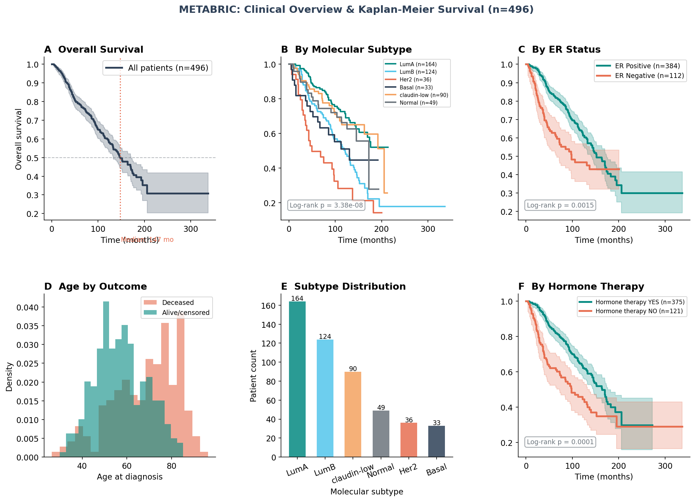
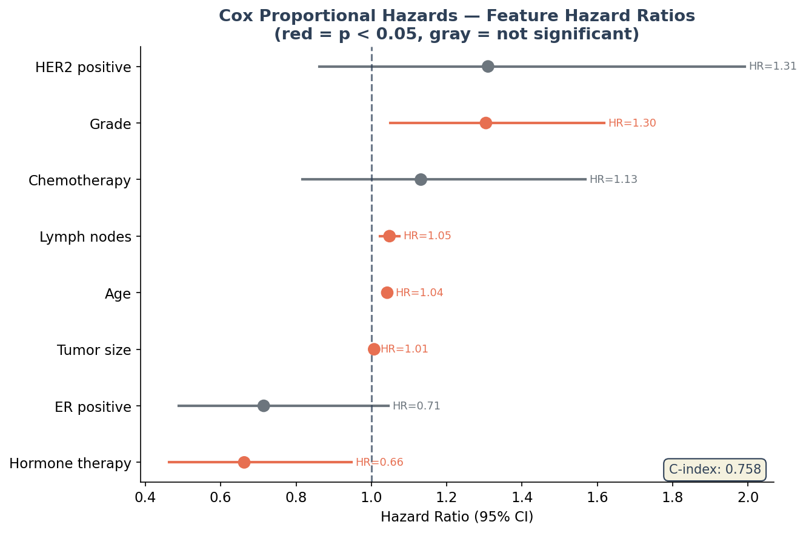
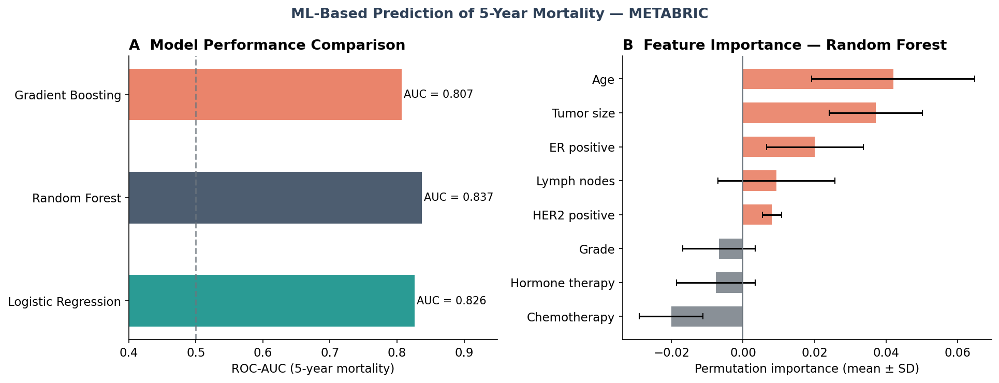
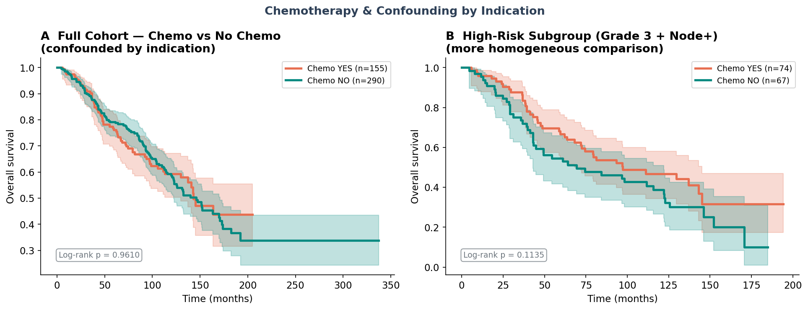
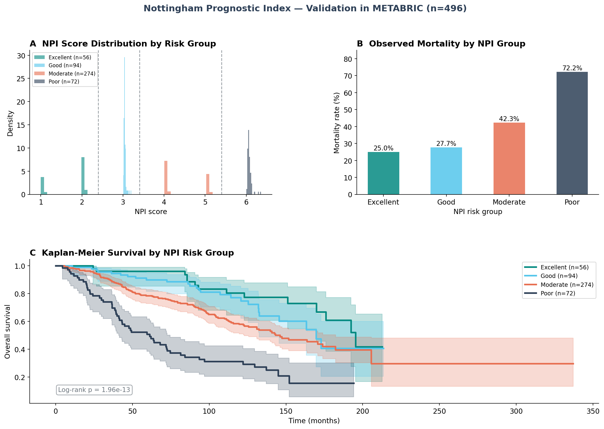
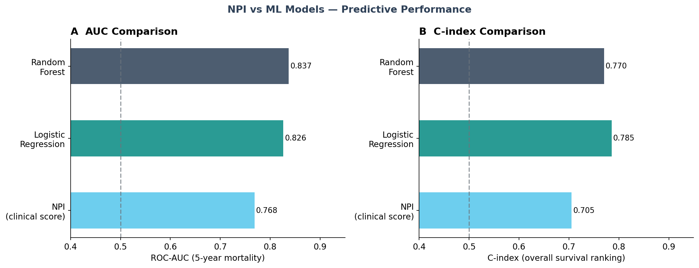
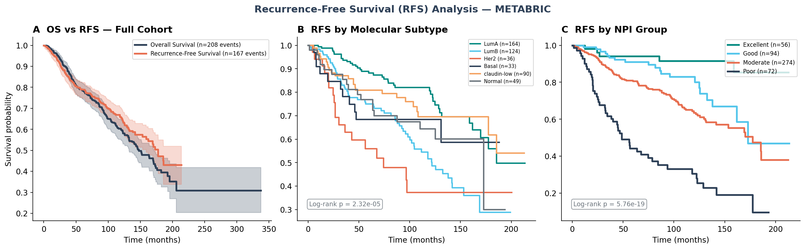
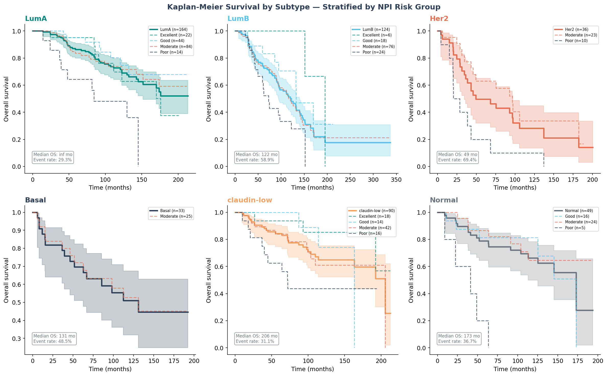
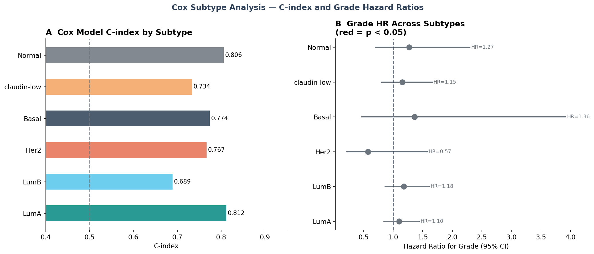

# Breast Cancer Survival Analysis — METABRIC

End-to-end survival analysis of breast cancer patients using the METABRIC dataset,
combining classical biostatistical methods with machine learning.

## Overview

METABRIC (Molecular Taxonomy of Breast Cancer International Consortium) is a 
landmark breast cancer study integrating clinical and molecular data from patients 
with long-term follow-up. This project analyzes overall survival across clinical 
and molecular subtypes, builds a multivariable Cox model, and develops ML-based 
5-year mortality prediction — including an epidemiological deep-dive into 
confounding by indication.

## Dataset

**Source:** [cBioPortal — METABRIC](https://www.cbioportal.org/study/summary?id=brca_metabric)  
**Patients:** 496 with complete survival data  
**Median follow-up:** 93.9 months (~7.8 years)  
**OS event rate:** 41.9% | **RFS event rate:** 33.7%  
No PHI involved — all data publicly available.

> Data files are not tracked in git. Download from cBioPortal and place in `data/raw/`.

## Analyses

### 1. Kaplan-Meier Survival Curves (`notebooks/01_eda.ipynb`)
- Overall cohort survival (median OS: ~150 months)
- Stratified by molecular subtype — LumA, LumB, HER2, Basal, claudin-low, Normal (log-rank p < 1e-08)
- Stratified by ER status (log-rank p = 0.0015)
- Stratified by hormone therapy (log-rank p = 0.0001)



### 2. Cox Proportional Hazards Model
Multivariable Cox regression controlling for age, grade, tumor size, lymph nodes,
ER/HER2 status, chemotherapy, and hormone therapy.

| Feature | Hazard Ratio | 95% CI | p-value |
|---|---|---|---|
| Age | 1.04 | 1.03–1.05 | < 0.005 |
| Lymph nodes | 1.05 | 1.02–1.07 | < 0.005 |
| Grade | 1.30 | 1.05–1.62 | 0.02 |
| Tumor size | 1.01 | 1.00–1.01 | 0.02 |
| Hormone therapy | 0.66 | 0.46–0.95 | 0.02 |

**C-index: 0.758**

Notable: ER status is significant in univariate KM (p=0.0015) but loses significance 
in the multivariable model — its effect is largely mediated by hormone therapy.



### 3. ML-Based Prediction of 5-Year Mortality
Binary classification: death within 60 months. Three models compared on held-out test set (25%).

| Model | ROC-AUC |
|---|---|
| Random Forest | **0.837** |
| Logistic Regression | 0.826 |
| Gradient Boosting | 0.807 |



### 4. Confounding by Indication — Chemotherapy Subgroup Analysis
Chemotherapy shows negative permutation importance in the full cohort model — 
a classic RWE challenge where sicker patients receive treatment, masking its benefit.

Subgroup analysis in high-risk patients (grade 3 + node-positive, n=141) 
reveals the expected direction: chemo is associated with improved survival, 
though not statistically significant due to sample size.



### 5. Nottingham Prognostic Index — Validation & Comparison (`notebooks/02_npi_analysis.ipynb`)
Validation of the NPI clinical score against observed survival in METABRIC, 
comparison against ML models, and RFS analysis.

- **NPI validates strongly** (log-rank p = 1.96e-13) — four risk groups show 
  clear, well-separated survival curves consistent with published literature
- **NPI achieves AUC 0.768 and C-index 0.705** with only 3 variables — 
  competitive with ML models trained on 8 features
- **Random Forest improves AUC by 0.069** (0.768 → 0.837) over NPI — 
  meaningful but modest gain for added complexity
- **NPI predicts RFS even more strongly than OS** (p = 5.76e-19) — 
  capturing recurrence risk particularly well





### 6. Subtype Deep-Dive (`notebooks/03_subtype_analysis.ipynb`)

Subgroup analysis examining whether prognostic factors identified in the full 
cohort hold within each molecular subtype.

- **HER2-enriched has the worst short-term prognosis** — 47.2% 5-year mortality 
  and median OS of 49 months
- **LumA never reaches 50% survival** within follow-up — confirming its 
  excellent prognosis
- **NPI stratifies survival within subtypes** — even within LumA (best prognosis), 
  the Poor NPI group shows dramatically worse outcomes
- **Grade loses significance within subtypes** despite being significant in the 
  full cohort — a classic example of Simpson's paradox
- **HER2 shows HR=0.57 for grade** — possibly reflecting better response to 
  targeted therapy in high-grade HER2+ tumors (exploratory, n=36)
- **LumB has the lowest C-index (0.689)** — suggesting unmeasured molecular 
  factors drive prognosis beyond clinical variables




## Stack

- **Python, pandas** — data ingestion and processing
- **lifelines** — Kaplan-Meier, Cox PH, log-rank tests
- **scikit-learn** — ML survival prediction, permutation importance
- **Matplotlib, seaborn** — visualizations
- **Jupyter** — documented EDA notebook

## Project Structure
```
metabric-survival/
├── data/
│   ├── raw/          # cBioPortal source files (not tracked in git)
│   └── processed/    # cleaned datasets (not tracked in git)
├── notebooks/
│   ├── 01_eda.ipynb  # main analysis notebook
│   └── figures/      # saved plots
├── src/
│   └── ingest.py     # data ingestion and cleaning
├── requirements.txt
├── .gitignore
└── README.md
```

## Setup

```bash
# Create and activate environment
pyenv virtualenv 3.11 metabric
pyenv activate metabric

# Install dependencies
pip install -r requirements.txt

# Download METABRIC clinical data from cBioPortal
# https://www.cbioportal.org/study/summary?id=brca_metabric
# Place in data/raw/brca_metabric_clinical_data.tsv

# Run ingestion
python src/ingest.py

# Launch notebook
jupyter notebook
```

## Key Takeaways

1. **Molecular subtype is the strongest prognosticator** — LumA has the best 
   prognosis; Basal and HER2 subtypes show the worst survival
2. **Clinical-only models achieve strong performance** — Random Forest AUC 0.837 
   using age, grade, tumor size, lymph nodes, and treatment variables
3. **Confounding by indication is a critical RWE challenge** — naive treatment 
   effect estimates require careful subgroup analysis or propensity score methods

---

**Author:** Raquel (Kely) Norel, PhD  
**Domain:** Oncology / Real-World Evidence  
**Status:** ✅ Complete